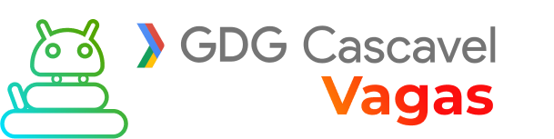

<h1 align="center">Vagas</h1>

:microscope: Espaço para divulgação de vagas no setor de tecnologia em Cascavel - PR.

# Vagas (Somente vagas de Tecnologia)

Espaço para a divulgação de vagas para desenvolvedores via _issues_ do Github.

Vagas disponíveis em https://github.com/gdg-cascavel/vagas/issues

### Cadastrando uma vaga

1. Abra uma **issue** e, no titulo desta _issue_, coloque o nome da vaga e nome da empresa entre colchetes .

Exemplo: `Front-End Developer na [NOME DA EMPRESA]`

2. Informe quais _labels_ devemos adicionar, contendo o nível de experiência desejada e a forma de contração.

**Atenção**: Não aceitaremos vagas sem o nome da empresa contratante. **ESTAS VAGAS SERÃO DELETADAS!**

#### Importante

1. Para evitar que possíveis candidatos enviem cvs para vagas já preenchidas, dê manutenção à sua issue, a cada 14 dias (2 semanas) coloque um comentário que continua procurando para a vaga ou feche a mesma comentando se a pessoa foi contratada através do nosso grupo ou por fora. Caso a issue passe de 14 dias e não tiver manutenção, a mesma poderá ser fechada por um moderador do repositório.

2. Se a vaga está pendente de informação e/ou fora do padrão especificado no [modelo da issue](https://github.com/gdg-cascavel/vagas/blob/master/.github/issue_template.md), um dos moderadores ou administradores poderá fechar a issue. Ela pode ser reaberta a qualquer momento, **desde que tenha sido devidamente preenchida**.

> #### **ESTE REPOSITÓRIO É EXCLUSIVO PARA VAGAS EM CASCAVEL OU REMOTO**  - Se a vaga fugir destes critérios ela será sumariamente deletada.

## Licença

[MIT](/LICENSE) &copy; FrontendBR